# Loadout Lab

Your gear, your enemy, your best kit. Pick a monster and Loadout Lab
computes the strongest set you actually OWN for every combat style -
exact DPS included - from live knowledge of your bank, inventory, and
equipment.

## What it does

- **Best owned set per style** (melee / ranged / magic) vs any monster,
  with exact DPS, max hit, and accuracy - engine verified against the
  official wiki DPS calculator.
- **Game-best comparison**: see the true ceiling set and how close your
  gear is, with gold borders on slots where you already own best-in-slot
  (stat-identical analogs count).
- **What to bring**: the prayer and boost the numbers assume (icons), the
  spell to autocast, the special-attack weapon to weave, and what to PRAY
  against the boss - including bosses whose attacks partially pierce
  protection prayers.
- **Incoming damage**: how hard the boss hits YOU in that set, with
  curated per-boss attack data (GWD, Zulrah, Vorkath, Cerberus, the
  wilderness ring, and more).
- **Optimize modes**: Max DPS (maximize output), Balanced (maximize
  dps-out^1.2 / dps-in - exact math in the feature guide), or Tanky
  (minimize damage taken).
- **Wilderness risk**: low-risk sets built around the items-kept-on-death
  rules - your 3-4 most valuable items ride protected, everything else
  stays under an adjustable gp risk cap, with per-item death fates
  (halo = protected, skull = lost, coins = repair fee) and honest gp
  totals including untradeable repair/mangle fees.
- **Dream items and upgrade budgets**: consider unowned gear ("what if I
  had a tbow?") or let a gp budget suggest buyable upgrades - quest
  rewards join free with their source quest named.
- **Bank tools**: "Show in bank" outlines the set's items; "Filter bank"
  shows only them (uses the core Bank Tags plugin).
- **Exclusions**: right-click any suggestion to protect rare supplies
  (dragon darts) from being recommended.
- **UIM storages**: the looting bag, POH costume room, sailing cargo
  holds, and STASH units (one read of the chart) are tracked
  automatically - no extra plugin needed. Anything else (cold storage,
  nest storage) can be counted as owned by name, or imported from the
  Dude, Where's My Stuff plugin.

## Getting started

1. Open your bank once so the plugin can learn what you own.
2. Search a monster in the sidebar panel and pick a style card.
3. Right-click items for exclusions, dream items, and stored-elsewhere
   marks; use the toggles for slayer tasks, spellbook locks, wilderness
   risk, and optimize modes.

## Privacy

Everything is local. The plugin writes two files under
`.runelite/loadout-lab/` on your machine only: `profile.json` (your
levels/bank snapshot, useful for bug reports) and `usage.tsv` (your own
search history). Nothing is ever sent anywhere.

## Data sharing (for other plugins)

Loadout Lab's owned-gear data is deliberately readable by other plugins
through the public ConfigManager API - the same zero-dependency way we
import from Dude, Where's My Stuff. No reflection needed:

- Config group: `loadoutlab`
- Keys: `<world>.<accountHash>.collection.<source>`, where `<world>` is
  `std` or `seasonal`, `<accountHash>` is `Client.getAccountHash()`, and
  `<source>` is `equipment`, `inventory`, `bank`, or `lootingBag`. The
  user's manually marked items live at `<world>.<accountHash>.manualOwned`.
- Values: JSON. Collection keys hold `{"<itemId>": <quantity>, ...}` maps
  (raw item ids, not canonicalized); `manualOwned` is a JSON array of ids.

Stability promise: these semantics never change silently. If the schema
ever has to change, the new shape gets a NEW key and existing keys keep
their meaning. A PluginMessage contract is the preferred interface and is
planned; config reads are the fallback that works even while a plugin is
disabled.

## License

BSD 2-Clause. DPS engine derived from
[best-dps](https://github.com/guccifurs/best-dps) (BSD-2-Clause);
monster and gear data from the OSRS Wiki.

# Feature guide

One section per user-facing feature. Each heading below is mirrored in
`docs/features.json`; `./gradlew checkDocs` audits the two against the
source tree and flags drift or missing screenshots.

### Best owned set per style

Pick a monster and Loadout Lab computes the strongest set you actually
OWN for melee, ranged, and magic - with exact DPS, max hit, and accuracy,
verified against the official wiki calculator.

### Game-best ceiling comparison

Every style card can show the true best-in-slot ceiling set beside yours,
so you see how close your kit is. Slots where you already own the best (or
a stat-identical analog) get a gold border.

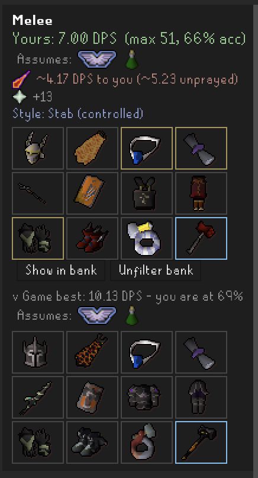

### Optimize modes

Exact definitions - `dps_out` is your damage per second into the monster;
`dps_in` is the monster's expected damage per second into YOU wearing that
set, at your real defence/magic levels with the best protection prayer up.

- **Max DPS** - maximize `dps_out`. Incoming damage is ignored entirely.
- **Tanky** - minimize `dps_in`, full stop. Ties go to the higher-dps set.
- **Balanced** - maximize the ratio `dps_out^1.2 / dps_in`. The 1.2
  exponent slightly favors output: a 10% dps gain is worth taking ~12%
  more damage. Balanced considers the Max DPS and Tanky sets too, so its
  ratio is always >= both by construction. Ties go to the higher-dps set.

How the candidates are found: the optimizer re-runs its search five times
with the beam scored as `dps_out - w * dps_in` for
`w = a * dps_out0 / dps_in0`, `a` in `{0.3, 0.7, 1.5, 3.0, 10.0}` (scaled
so the weights are comparable across monsters). That traces the
(dps out, dps in) frontier from full glass-cannon to full turtle; each
mode then picks its point off that frontier. The card's sword/shield note
shows the trade the pick made vs the Max DPS set ("10%- / 56%+" = 10%
less dps for 56% less damage taken).

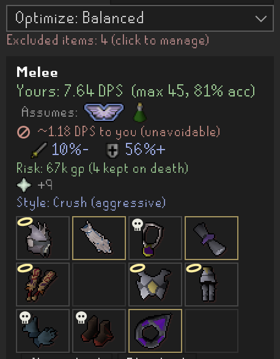

### Owned-gear ledger (profile-aware)

Your owned gear is learned from your bank, inventory, equipment, and
looting bag as you play, and remembered per account so suggestions always
reflect what THIS character actually has.

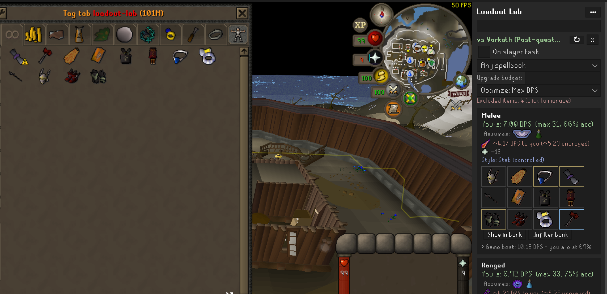

### Incoming damage and protection prayer

See how hard the boss hits YOU in the chosen set, from curated per-boss
attack data, plus which protection prayer to use - including bosses whose
attacks partially pierce prayer.

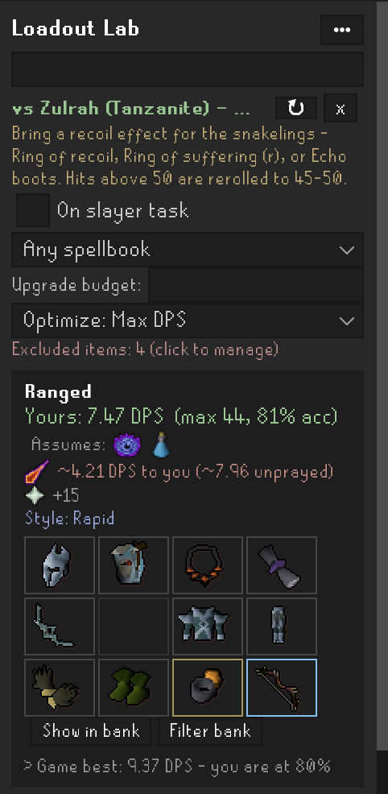

### Spell and spellbook recommendation

On the magic card, Loadout Lab shows the spell to autocast. Lock the
spellbook to your setup and the suggested spell and set adjust to match.

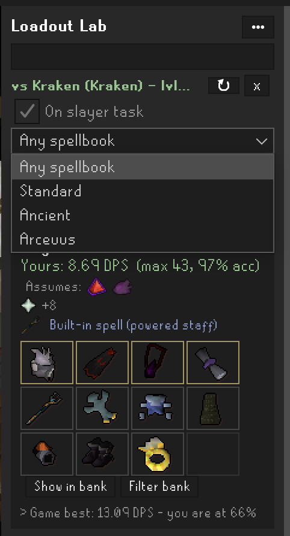

### Dream items

Right-click any suggestion you do not own ("what if I had a tbow?") to
highlight it as an aspirational pick and see the set it would build.

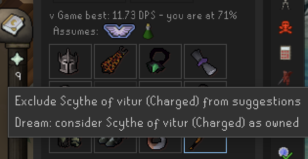

### Upgrade budget

Enter a gp budget and Loadout Lab suggests buyable upgrades within it; use
"-" for the unlimited ceiling. Quest rewards join for free with their
source quest named.

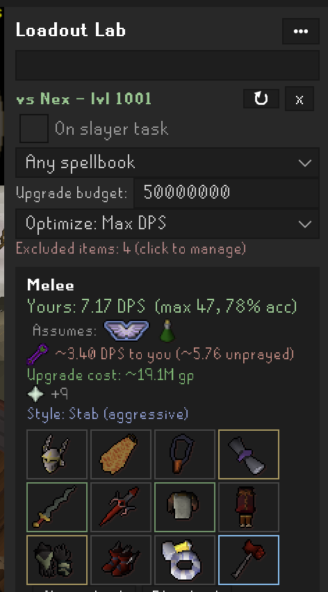

### Stored elsewhere (manual owned items)

Gear kept where no plugin can see it - an Ultimate Ironman's cold or
nest storage, a friend's holding, anything untracked - can still count
as owned: right-click an unowned suggestion and pick "Stored elsewhere",
or add any item by name from the header Options menu. The list is kept
per account, marked items join suggestions, bank borders, and the
exported profile exactly like banked gear, and the green "Stored
elsewhere" line in the panel manages them. (The looting bag, POH costume
room, STASH units, and cargo holds need no marking - see the next
sections.)

### STASH, POH costume room, and cargo hold tracking

These storages track natively, the same way the bank does - open each
once and the contents count as owned from then on:

- **STASH units**: read the STASH unit chart (the noticeboard by
  Watson's house) once. Every filled unit across all tiers counts its
  stored items as owned in that single read - no visiting each unit.
- **POH costume room**: open a costume storage (armour case, wardrobe,
  treasure chest, cape rack) in your house once.
- **Cargo holds**: open a boat's cargo hold once - cannonballs stored
  there count for ranged setups.

### Dude, Where's My Stuff import

If you run the Dude, Where's My Stuff plugin, the gear storages it has
seen are also counted as owned - useful for death storage (which Loadout
Lab does not track) and for instantly seeding storages you opened before
installing Loadout Lab. This is a best-effort read of the data DWMS has
already saved (it even works while DWMS is disabled), with strictly
defensive parsing: if a future DWMS update changes its format, items
quietly stop importing rather than ever miscounting, and the
stored-elsewhere list remains the manual override. A muted panel line
shows how many items came in this way.

### Wilderness low-risk sets

Build low-risk sets around the items-kept-on-death rules: your most
valuable items ride protected while everything else stays under an
adjustable gp risk cap. Per-item death fates and honest kept/lost gp
totals include untradeable repair and mangle fees.

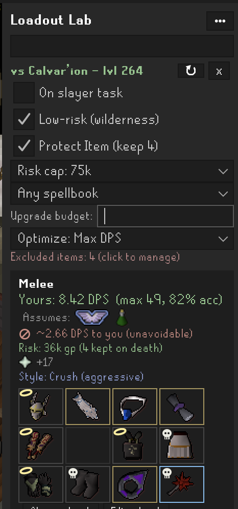

### Slayer task toggle

Flip the slayer-task toggle to fold in slayer-helm bonuses; bosses locked
behind an active task are greyed out.

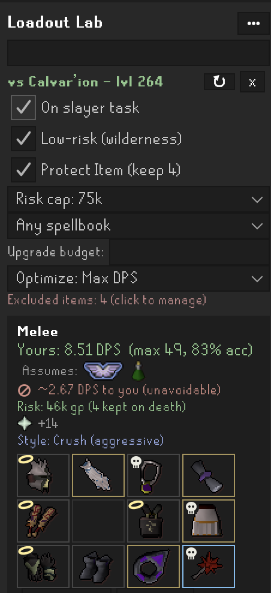

### Exclude items from suggestions

Right-click a suggestion to protect rare supplies (like dragon darts) so
the optimizer stops recommending them.

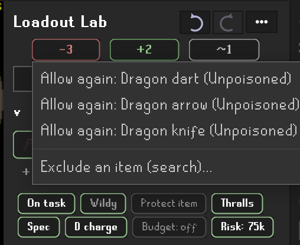

### Bank tools: show and filter

"Show in bank" outlines the set's items in your bank; "Filter bank" shows
only them. Uses the core Bank Tags plugin.

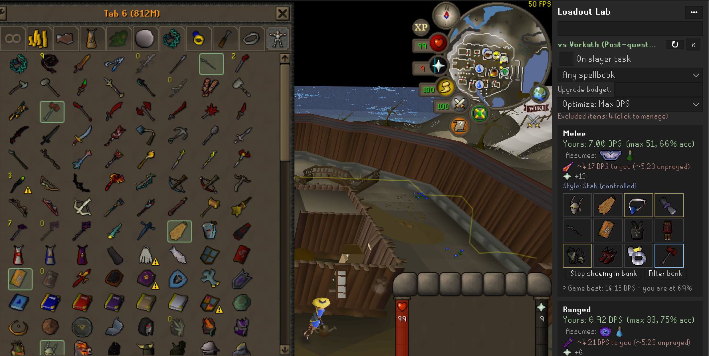

### Search in Loadout Lab (cross-plugin)

Right-click a monster in the world and choose "Search in Loadout Lab":
the panel opens and computes the best owned set for it. Other plugins can
send a monster the same way (Goal Planner's boss cards are rolling it out).

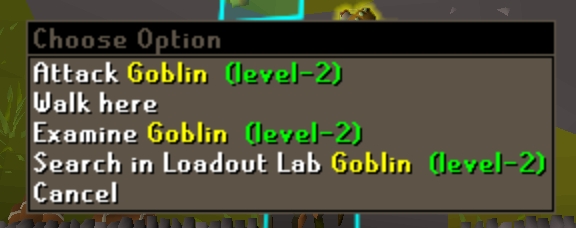

### Community Discord

The header Options menu has a "Join our Discord" link to the plugin's
community server.

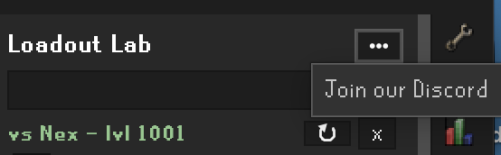

