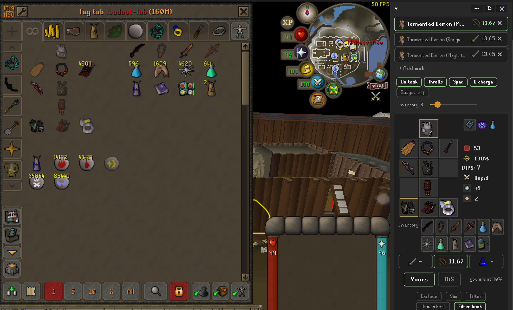
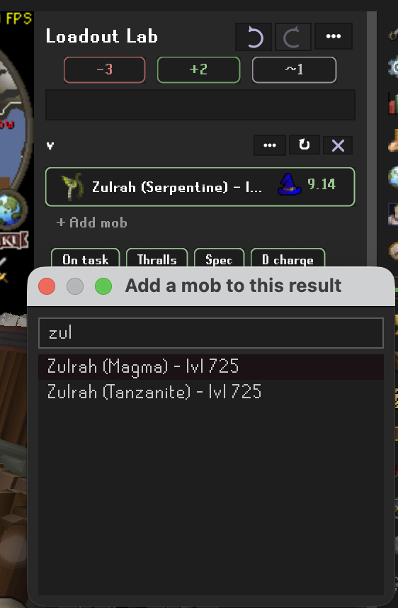
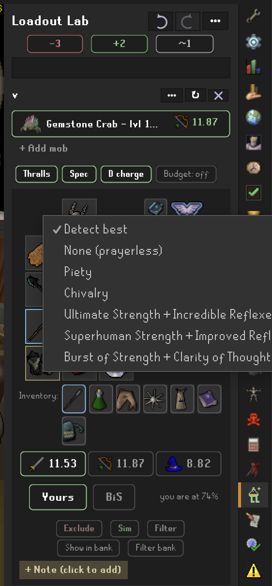
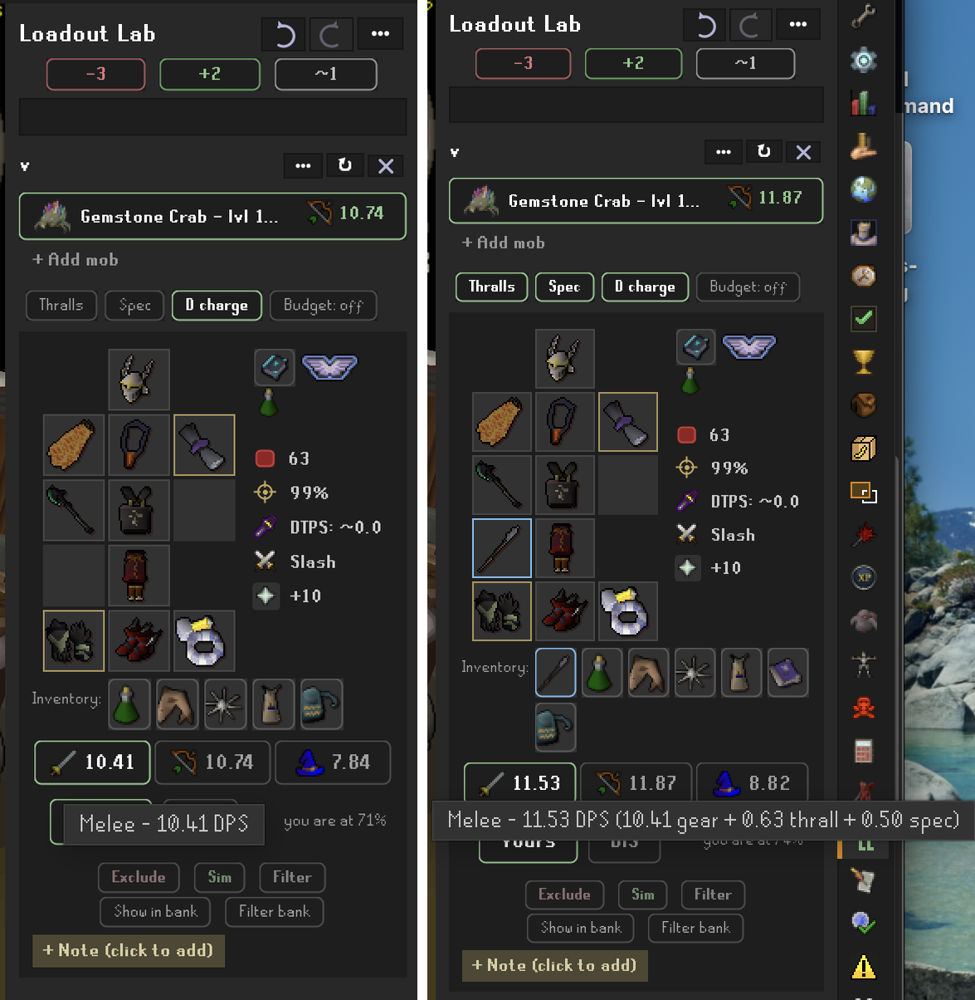
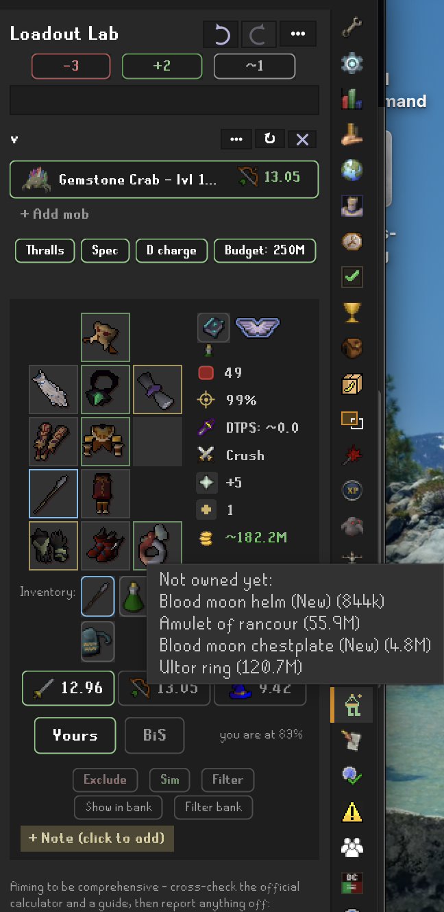
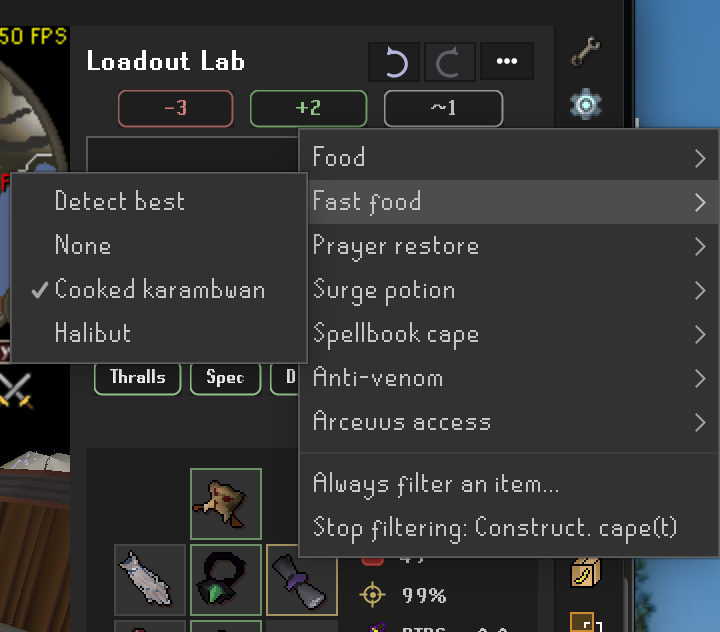
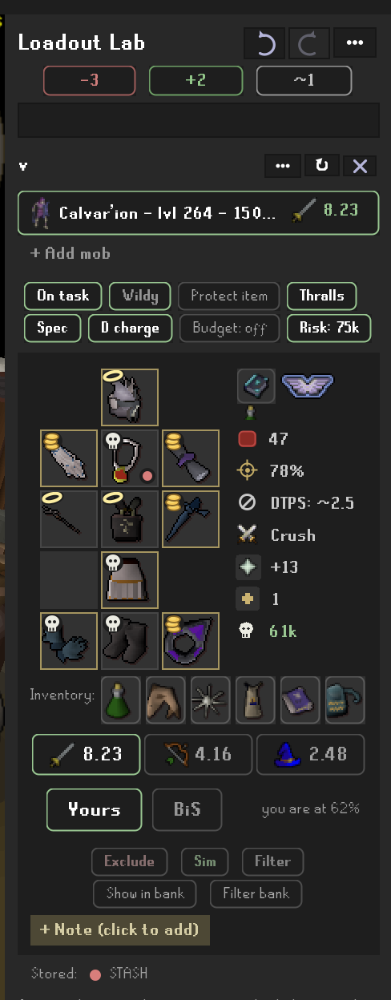

# Loadout Lab

"What should I bring?" is a bank-standing question. Loadout Lab answers
it quickly, optimizing any mob, boss, or even a full raid around the
best gear you own - in your bank, your storages, or wherever you keep
it. Keep it simple and let the plugin do the work, or reach beyond
your own gear with the powerful simulation and customization options.
At the end of your search, filter the kit in your bank and get going.

## What it does

- **Best owned set per style** (melee / ranged / magic) vs any monster,
  with exact DPS, max hit, and accuracy - engine verified against the
  official wiki DPS calculator across a scenario battery (known deltas
  tracked in docs/ENGINE-GAPS.md).
- **Game-best comparison**: see the true ceiling set and how close your
  gear is, with gold borders on slots where you already own best-in-slot
  (stat-identical analogs count).
- **What to bring**: the prayer and boost the numbers assume (icons), the
  spell to autocast, the special-attack weapon to weave, and what to PRAY
  against the boss - including bosses whose attacks partially pierce
  protection prayers.
- **Incoming damage**: how hard the boss hits YOU in that set, with
  curated per-boss attack data (GWD, Zulrah, Vorkath, Cerberus, the
  wilderness ring, and more).
- **Wilderness risk**: low-risk sets built around the items-kept-on-death
  rules - your 3-4 most valuable items ride protected, everything else
  stays under an adjustable gp risk cap, with per-item death fates
  (halo = protected, skull = lost, coins = repair fee) and honest gp
  totals including untradeable repair/mangle fees.
- **Simulated items and upgrade budgets**: consider unowned gear ("what if I
  had a tbow?") or let a gp budget suggest buyable upgrades - quest
  rewards join free with their source quest named.
- **Bank tools**: "Show in bank" outlines the set's items; "Filter bank"
  shows only them (uses the core Bank Tags plugin).
- **Exclusions**: right-click any suggestion to protect rare supplies
  (dragon darts) from being recommended.
- **Mob profiles**: per-monster pins ("always bring my Bracelet of
  slaughter HERE"), your own notes, and trip supplies that join the
  bank Show/Filter views - remembered per mob.
- **UIM storages**: the looting bag, POH costume room, sailing cargo
  holds, and STASH units (one read of the chart) are tracked
  automatically - no extra plugin needed. Anything else (cold storage,
  nest storage) can be counted as owned by name, or imported from the
  Dude, Where's My Stuff plugin (togglable under the plugin's settings,
  in the Connections section).

## Getting started

1. Open your bank once so the plugin can learn what you own.
2. Search a monster in the sidebar panel and pick a style card.
3. Right-click items for exclusions, simmed items, and stored-elsewhere
   marks; use the toggles for slayer tasks, spellbook locks, and
   wilderness risk.

## Privacy

Everything is local. The plugin writes two files under
`.runelite/loadout-lab/` on your machine only: `profile.json` (your
levels/bank snapshot, useful for bug reports) and `usage.tsv` (your own
search history). Nothing is ever sent anywhere.

## Data sharing (for other plugins)

Loadout Lab's owned-gear data is deliberately readable by other plugins,
two ways.

Preferred - ask over the PluginMessage bus (the same bidirectional
request/response shape DWMS answers under its namespace):

- Request: namespace `loadoutlab`, name `storages-request`, data
  `{"source": "<your plugin's display name>"}` (required; unattributed
  requests are ignored).
- Response (posted on the client thread): name `storages-response`, data
  `source` (`"Loadout Lab"`), `target` (your `source` echoed back -
  filter on it), `version` (Integer `1`), and `storages` - a List of
  Maps, one per non-empty source, each with `category` (String,
  `collection` or `manual`), `name` (String, the source key below),
  `lastUpdated` (Long, `-1`; the ledger keeps no timestamps), and
  `items` (List of `{"id": Integer canonical item id, "quantity" Long}`).

Fallback - read the persisted config through the public ConfigManager
API, which works even while Loadout Lab is disabled. No reflection
needed:

- Config group: `loadoutlab`
- Keys: `<world>.<accountHash>.collection.<source>`, where `<world>` is
  `std` or `seasonal`, `<accountHash>` is `Client.getAccountHash()`, and
  `<source>` is `equipment`, `inventory`, `bank`, or `lootingBag`. The
  user's manually marked items live at `<world>.<accountHash>.manualOwned`.
- Values: JSON. Collection keys hold `{"<itemId>": <quantity>, ...}` maps
  (raw item ids, not canonicalized); `manualOwned` is a JSON array of ids.

Stability promise: these semantics never change silently. If the message
or config schema ever has to change, the new shape gets a new version /
a NEW key, and existing shapes keep their meaning.

## License

BSD 2-Clause. DPS engine derived from
[best-dps](https://github.com/guccifurs/best-dps) (BSD-2-Clause);
monster and gear data from the OSRS Wiki.

# Feature guide

The guide follows the way a trip actually comes together: pick the
target, read the answer, shape it to the fight, then make the defaults
yours. Each heading below is mirrored in `docs/features.json`;
`./gradlew checkDocs` audits the two against the source tree and flags
drift or missing screenshots.

## 1. Pick the target

Search any monster by name, right-click one in the world, or pull in a
whole group or raid - then grow or trim the lineup until it matches the
trip you are planning.

### Search in Loadout Lab (cross-plugin)

Right-click a monster in the world and choose "Search in Loadout Lab":
the panel opens and computes the best owned set for it. Other plugins can
send a monster the same way (Goal Planner's boss cards are rolling it out).

### Multi-mob rosters: groups and raids

One trip rarely means one monster. Any result grows into a roster: the
'+ Add mob' row appends another target, and searching a curated group
lands the whole lineup at once - Fight Caves, the Inferno, Zulrah's
forms, Dagannoth Kings, Barrows, Tormented Demons, the Theatre of Blood,
Tombs of Amascut, Chambers of Xeric, the Fortis Colosseum, Nex, Yama and
more. The optimizer then finds ONE shared set per style across the whole
list - the kit you actually bring - with each mob shown as its own row:
its dps in that shared set, the style that answers it, and a lens that
flips every card and number to that mob on click. Any mob can leave via
its row's X (the last one closes the result), so a raid roster can be
trimmed to the rooms you actually fight. Inside raids, the supplied
boost (CoX overloads, ToA salts) is a toggle, not a promise.

### Slayer task toggle

Flip the slayer-task toggle to fold in slayer-helm bonuses; bosses locked
behind an active task are greyed out.

### Undo and redo

The header's back/forward arrows walk your last 50 steps - monster
searches, panel settings, AND edits in one history: search Zulrah,
flip the slayer toggle, search Vorkath - back, back, back retraces
each of those in turn. Steps cover: monster selections; the toggles
(F2P, slayer task, wilderness, low-risk, Protect Item); the spellbook
and risk-cap dropdowns; the upgrade budget; the antifire flip; and
every edit (exclusions, pins, notes, simmed items, stored-elsewhere
marks, protect-only flags, pinned spells, trip supplies). Hover for
exactly what's next ("Back: Spellbook: Ancient").
Scan-driven changes (bank snapshots, storage captures) are never
steps - only what you deliberately did. History is per-session and
resets on profile switch.

## 2. Read the answer

Every style card is a full battle plan - and every line of it can be
toggled in the Display options or compared against the true game-wide
ceiling. When it is time to gear up, the same answer projects into your
bank.

### Best owned set per style

Pick a monster and Loadout Lab computes the strongest set you actually
OWN for melee, ranged, and magic - with exact DPS, max hit, and accuracy,
verified against the official wiki calculator. When poison tiers of the
same weapon tie on stats, the strongest venom wins the suggestion
(dragon dagger p++ over plain, main hand and spec alike).

### Game-best ceiling comparison

Every style card can show the true best-in-slot ceiling set beside yours,
so you see how close your kit is. Slots where you already own the best (or
a stat-identical analog) get a gold border.

### Incoming damage and protection prayer

See how hard the boss hits YOU in the chosen set, from curated per-boss
attack data, plus which protection prayer to use - including bosses whose
attacks partially pierce prayer.

### Spell and spellbook recommendation

On the magic card, Loadout Lab shows the spell to autocast. Lock the
spellbook to your setup and the suggested spell and set adjust to match.

### Owned-gear ledger (profile-aware)

Your owned gear is learned from your bank, inventory, equipment, and
looting bag as you play, and remembered per account so suggestions always
reflect what THIS character actually has.

### Bank tools: show and filter

"Show in bank" outlines the set's items in your bank; "Filter bank" shows
only them, arranged like the in-game equipment and inventory tabs - the
worn set as the equipment cross, the carried kit in a 4-wide block beside
it. Uses the core Bank Tags plugin.

## 3. Shape the fight

The computed answer is a starting point. Every assumption is a control:
the chips on each card, the prayer and boost pickers, the inventory
budget, simulated gear, budgets and risk caps - tune them and the
optimizer re-answers.

### Assumption pickers: prayer and boost

The prayer and potion icons on each style card are pickers. Detect best
stays the default - the boost detect reads what you actually own, the
prayer detect your unlocks - and clicking an icon overrides that style's
assumption: any named tier (Piety, Chivalry, Rigour, Deadeye, Augury,
Mystic Might...), any boost including overloads and smelling salts
outside raids, or None. Divine potions are preferred: the BiS ceiling
assumes the divine super combat / divine ranging potion, and your side
assumes the divine variant whenever you own one (same boost numbers,
but the boost holds at ceiling instead of decaying). An accent border marks an override; the numbers,
the assume label and the consumable cells all follow. Handy when a low
prayer-bonus setup cannot sustain Piety and you want the DPS you will
actually do.

### Thralls and Death Charge

Arceuus support, modeled honestly. The Thralls chip appears when your
Magic reaches a tier (38/57/76) and you own the book of the dead - it
defaults ON against 150+ hp targets, folding the tier's flat dps
(greater: 0.625, always hits) into the shown numbers, exactly like the
official calculator's thrall toggle; the tab tooltip shows the
gear/thrall breakdown, and the ranking never moves (a thrall adds the
same to every set). The D charge chip (Magic 80) assumes Death Charge -
15% special attack energy per killing blow, once per 60-second cast -
feeding the spec model's energy budget, so long energy-bound fights fit
more special attacks. Both recommendations carry their dependencies:
the book of the dead and your best rune pouch join the trip cells, and
the resurrect / Death Charge / Mark of Darkness runes (the last when
your magic card casts Demonbane) join the bank filter and setup layout.
(Vengeance modeling is roadmapped with the spellbook-lock work.)

### Inventory budget: swaps vs bag space

The Inventory slider on a roster sets how many carried swaps the shared
set may lean on, and it optimizes honestly in BOTH directions. Push it
up and the optimizer may answer different mobs with different weapons or
armour pieces - more dps, more slots. Pull it down and it hunts the best
single set that needs nothing carried - more room for food and loot on a
long trip. The special-attack weapon occupies a swap slot whenever it
differs from the worn weapon, so the spec is never free bag space.

### Trip supplies

Excludes, sims and bank filters form a trio - red, green and grey - at
two levels: global chips above the search bar, and per-mob "here" chips
on every card that override the global level. The grey member manages
the trip kit: persistent defaults for the food, fast food, prayer
restore, surge potion, spellbook-swap cape and anti-venom every trip
brings, plus an always-filter list for items like teleport capes that
belong in every bank view. Detect best picks the highest tier your
collection has; anti-venom only joins the kit against monsters that can
actually inflict venom (Zulrah, Araxxor, Vorkath and friends). Chosen
supplies ride the result card's consumable cells, the bank filter (every
dose matches) and the filtered bank's inventory block.

### Simulated items

Right-click any suggestion you do not own ("what if I had a tbow?") to
sim it - considered as owned - and see the set it would build. Any item
can be simmed proactively from the green + chip above the search bar or
the header "..." menu ("Sim an item"), both of which also list your
current simmed items so one that never wins a slot can still be
removed.

### Upgrade budget

Enter a gp budget and Loadout Lab suggests buyable upgrades within it; use
"-" for the unlimited ceiling. Quest rewards join for free with their
source quest named.

### Exclude items from suggestions

Right-click a suggestion to protect rare supplies (like dragon darts) so
the optimizer stops recommending them - everywhere, only against this
monster, or only against this monster's melee/ranged/magic set. Per-mob
exclusions are managed from the "This mob" line.

### Wilderness low-risk sets

Build low-risk sets around the items-kept-on-death rules: your most
valuable items ride protected while everything else stays under an
adjustable gp risk cap. Per-item death fates and honest kept/lost gp
totals include untradeable repair and mangle fees - and curated
"rebuild errand" friction for gear that is gp-free to replace but
costs a real trip (the salve line's tomb-and-re-imbue run, an imbued
ring's re-imbue visit). Low-risk sets NEVER put such an item at risk:
it may ride a kept slot (a protected slayer helmet is standard
practice), but if it would be lost or broken it is swapped out of the
suggestion entirely, no matter the risk cap.

You can extend that treatment to any item yourself: right-click a
suggestion shown with the death skull and pick "Only bring if protected
on death". The optimizer then keeps that item protected or leaves it out
of the set - never risking it - just like the rebuild-friction gear.

### Revenant and wilderness gear conditionals

Charged wilderness weapons (Craw's bow, Webweaver bow, the chainmaces,
the sceptres) get their +50% accuracy and damage against wilderness
monsters. The Amulet of avarice boosts you against revenants - and the
risk model knows it keeps you skulled, so your usual three protected
items drop to zero (one with Protect Item). A charged Bracelet of
ethereum zeroes the revenant incoming-damage line. All verified against
the official wiki calculator's engine.

Monsters that also live outside the Wilderness (hellhounds, dust
devils, green dragons...) get an "In the Wilderness" checkbox: the
+50% and the risk options apply only when you say the fight is
actually happening there. Wilderness-exclusive monsters (revenants,
the boss ring) are always "in".

## 4. Make it yours

Set your own defaults, teach the plugin what you own wherever it is
stored, and pin the per-mob decisions worth remembering.

### Panel options: display and controls

Every card line and control is optional, across three settings sections.
Display toggles each detail line (max hit, accuracy, damage taken, the
defensive-prayer call, risk on death, prayer bonus, attack style, the
inventory row, game best, notes, the '+ Add mob' row, the footnote, the
loading animation, and where the spec and thrall dps appear - in the
numbers, as a footnote, or not shown). Controls picks which chips and buttons appear
(exclude / sim / filter / pins, bank buttons, spell selection, budget and
wilderness controls). Defaults sets what every NEW result assumes: On
task, the Spec chip, thralls and Death Charge (Detect best or None),
autocast (Detect or powered staves only), a prayer tier and a boost
(Detect best, None, or a named pick), the budget and risk-cap seeds,
antifire, and Arceuus via Spellbook Swap - the per-card chips and
pickers still override each mob.

### Mob profiles: pins, notes, and bank-filter items

Every monster remembers your preferences for it - scoped to one combat
set or all of them. PIN an item (right-click a cell's Pin submenu, or
the card's dots menu, both opening the native in-game item search) - a
Bracelet of slaughter stretching that slayer task - and that card
always brings it, owned or not, with the optimizer building the best
set around it; a melee-only pin never touches your ranged card. Pins
outrank exclusions, budgets, and the low-risk safety vetoes while the
risk numbers stay honest, and game best stays unpinned so you can see
what the preference costs. The mob's NOTE is a collapsible post-it
under the storage lines, edited inline - click, type, click away.
BANK-FILTER ITEMS are per-set trip supplies (a super combat on the
melee card, a ranged potion on ranged, sharks everywhere) that join
that card's "Show in bank" and "Filter bank" views. The "This mob: ..."
line manages everything, and each style card collapses to its DPS
header - sets a standard deviation under your best start collapsed.
The magic card hosts its own controls: PIN THE SPELL ("I am casting
Wind Bolt") and the gear optimizes around it, with the spellbook lock
shown while the spell is on Auto.

### Stored elsewhere (manual owned items)

Gear kept where no plugin can see it - an Ultimate Ironman's cold or
nest storage, a friend's holding, anything untracked - can still count
as owned: right-click an unowned suggestion and pick "Stored elsewhere",
or add any item by name from the header Options menu. The list is kept
per account, marked items join suggestions, bank borders, and the
exported profile exactly like banked gear, and the green "Stored
elsewhere" line in the panel manages them. (The looting bag, POH costume
room, STASH units, and cargo holds need no marking - see the next
sections.)

### STASH, POH costume room, and cargo hold tracking

These storages track natively, the same way the bank does - open each
once and the contents count as owned from then on:

- **STASH units**: read the STASH unit chart (the noticeboard by
  Watson's house) once. Every filled unit across all tiers counts its
  stored items as owned in that single read - no visiting each unit.
- **POH costume room**: open a costume storage (armour case, wardrobe,
  treasure chest, cape rack) in your house once.
- **Cargo holds**: open a boat's cargo hold once - cannonballs stored
  there count for ranged setups.

### Where your gear is (location hints)

The ledger remembers which storage each item was seen in, not just that
you own it. Suggested items that need a fetch trip - a STASH, the POH
costume room, a cargo hold, the looting bag - carry a small colored dot
in the cell corner naming the storage, with a "Stored:" legend under the
cards that lists only the sources actually on screen. Gear at hand
(equipped, inventory, bank) stays unmarked, so an all-bank set shows no
dots and no legend at all. The tooltip spells it out too ("stored in
STASH"), and the profile export carries the same per-source breakdown
for bug reports.

### Dude, Where's My Stuff link

If you run the Dude, Where's My Stuff plugin (2.11.5+), the gear
storages it tracks are also counted as owned - useful for death storage
(which Loadout Lab does not track) and for storages you opened before
installing Loadout Lab. Loadout Lab asks DWMS directly over the
PluginMessage bus and gets its exact tracked items back, storage by
storage, feeding both ownership and the location hints. The
stored-elsewhere list remains the manual override, and a muted panel
line shows how many items came in this way.

### Community Discord

The header Options menu has a "Join our Discord" link to the plugin's
community server.

