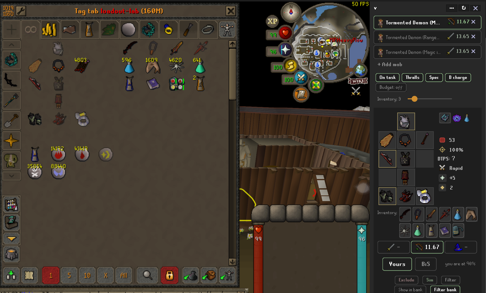

# Loadout Lab

"What should I bring?" is a bank-standing question. Loadout Lab answers
it quickly, optimizing any mob, boss, or even a full raid around the
best gear you own - in your bank, your storages, or wherever you keep
it. Keep it simple and let the plugin do the work, or reach beyond
your own gear with the powerful simulation and customization options.
At the end of your search, filter the kit in your bank and get going.

## What it does

- **Best owned set per style** (melee / ranged / magic) vs any monster,
  with exact DPS, max hit, and accuracy - engine verified against the
  official wiki DPS calculator across a scenario battery (known deltas
  tracked in docs/ENGINE-GAPS.md).
- **Game-best comparison**: see the true ceiling set and how close your
  gear is, with gold borders on slots where you already own best-in-slot
  (stat-identical analogs count) and the gp cost of the pieces you lack.
- **What to bring**: the prayer and boost the numbers assume (icons), the
  spell to autocast, the special-attack weapon to weave, and what to PRAY
  against the boss - including bosses whose attacks partially pierce
  protection prayers.
- **Incoming damage**: how hard the boss hits YOU in that set, with
  curated per-boss attack data (GWD, Zulrah, Vorkath, Cerberus, the
  wilderness ring, and more).
- **Boss mechanics, priced into the math**: the Sire's vents and their
  demonbane one-shots, Kalphite Queen's prayer-piercing Verac's, the
  Inferno nibblers' barrage lock, Salarin's flat Strikes, the ToA
  Wardens' core spec dump, ToA invocation scaling with an on-card
  control - each modeled in the numbers and explained on the card.
- **Compute animations**: every boss, group and raid plays its own
  mood while the numbers cook, drawn in colour from the wiki renders.
- **Ship combat**: sea monsters from the Sailing update are fought from
  your boat - pick each cannon's material and who fires it, the shared
  cannonball tier, your keel for the damage the boat takes - and the
  card adds it up: set, spec, each cannon, total.
- **Wilderness risk**: low-risk sets built around the items-kept-on-death
  rules - your 3-4 most valuable items ride protected, everything else
  stays under an adjustable gp risk cap, with per-item death fates
  (halo = protected, skull = lost, coins = repair fee) and honest gp
  totals including untradeable repair/mangle fees.
- **Simulated items and upgrade budgets**: consider unowned gear ("what if I
  had a tbow?") or let a gp budget suggest buyable upgrades - quest
  rewards join free with their source quest named.
- **Bank tools**: "Show in bank" outlines the set's items; "Filter bank"
  shows only them (uses the core Bank Tags plugin).
- **Exclusions**: right-click any suggestion to protect rare supplies
  (dragon darts) from being recommended.
- **Mob profiles**: per-monster pins ("always bring my Bracelet of
  slaughter HERE"), your own notes, and trip supplies that join the
  bank Show/Filter views - remembered per mob.
- **UIM storages**: the looting bag, POH costume room, sailing cargo
  holds, and STASH units (one read of the chart) are tracked
  automatically - no extra plugin needed. Anything else (cold storage,
  nest storage) can be counted as owned by name, or imported from the
  Dude, Where's My Stuff plugin (togglable under the plugin's settings,
  in the Connections section).

## Getting started

1. Open your bank once so the plugin can learn what you own.
2. Search a monster in the sidebar panel and pick a style card.
3. Right-click items to exclude them or sim them as owned; use the
   chips for slayer tasks, spellbook locks, and wilderness risk.

## Feature guide

Every feature above and a few dozen more - rosters, pins, budgets,
supplies, storages - screenshotted stage by stage the way a trip comes
together, in the full
**[feature guide](https://github.com/AKAddons/runelite-loadout-lab/blob/main/docs/GUIDE.md)**.

## Privacy

Everything is computed locally - your bank, your levels and every DPS
answer never leave your machine. The plugin writes under
`.runelite/loadout-lab/`: `profile.json` (your levels/bank snapshot,
useful for bug reports) and `npc-icons/` (cached monster pictures).

Two features do reach the internet, both to the OSRS wiki and nowhere
else:

- **Wiki calc** - only when you click the button. It uploads the setup
  shown on the card (gear ids, your combat levels, prayers and boosts)
  to the wiki's shortlink service, then opens the calculator on the
  result. Nothing is sent unless you click.
- **Monster pictures** - one request per monster to the wiki's file
  path, cached on disk. Switch it off under *Connections -> Monster
  pictures* and no wiki request is ever made.

No account name, no analytics, no telemetry, and nothing at all is sent
while the plugin sits idle.

## Data sharing (for other plugins)

Loadout Lab's owned-gear data is deliberately readable by other plugins,
two ways.

Preferred - ask over the PluginMessage bus (the same bidirectional
request/response shape DWMS answers under its namespace):

- Request: namespace `loadoutlab`, name `storages-request`, data
  `{"source": "<your plugin's display name>"}` (required; unattributed
  requests are ignored).
- Response (posted on the client thread): name `storages-response`, data
  `source` (`"Loadout Lab"`), `target` (your `source` echoed back -
  filter on it), `version` (Integer `1`), and `storages` - a List of
  Maps, one per non-empty source, each with `category` (String,
  `collection` or `manual`), `name` (String, the source key below),
  `lastUpdated` (Long, `-1`; the ledger keeps no timestamps), and
  `items` (List of `{"id": Integer canonical item id, "quantity" Long}`).

Fallback - read the persisted config through the public ConfigManager
API, which works even while Loadout Lab is disabled. No reflection
needed:

- Config group: `loadoutlab`
- Keys: `<world>.<accountHash>.collection.<source>`, where `<world>` is
  `std` or `seasonal`, `<accountHash>` is `Client.getAccountHash()`, and
  `<source>` is `equipment`, `inventory`, `bank`, or `lootingBag`. The
  user's manually marked items live at `<world>.<accountHash>.manualOwned`.
- Values: JSON. Collection keys hold `{"<itemId>": <quantity>, ...}` maps
  (raw item ids, not canonicalized); `manualOwned` is a JSON array of ids.

Stability promise: these semantics never change silently. If the message
or config schema ever has to change, the new shape gets a new version /
a NEW key, and existing shapes keep their meaning.

## License

BSD 2-Clause. DPS engine derived from
[best-dps](https://github.com/guccifurs/best-dps) (BSD-2-Clause);
monster and gear data from the OSRS Wiki.
